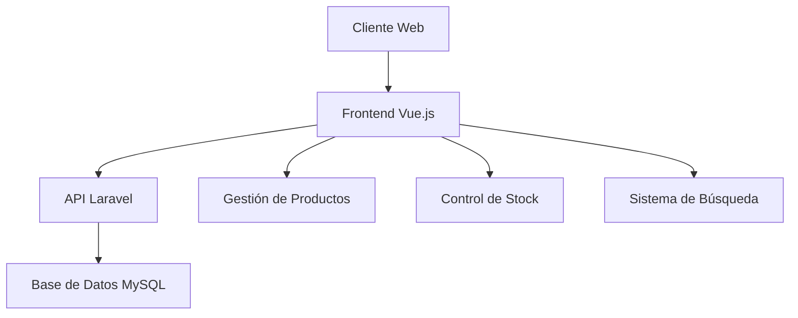

# Gestión de Inventario
<aside>
🛠️ Proyecto de Antonio García Barrera

</aside>

## Descripción General

Sistema de Gestión de Inventario, aplicación para facilitar el control y la administración de productos en un inventario. Permitirá a los usuarios gestionar productos y categorías, controlar el stock disponible, y registrar operaciones de entrada y salida de mercancías.

Además, incorpora funcionalidades como el filtrado y la búsqueda de productos.

## Características Principales

- Control de inventario
- Gestión de productos y categorías
- Sistema de búsqueda y filtrado
- Control de stock
- Interfaz intuitiva
- Sistema de autenticación seguro

## Objetivos del Proyecto

El objetivo general de la aplicación es permitir gestionar el inventario, controlando las existencias de los productos.

1. Gestionar productos: Permitir a los usuarios agregar, editar y eliminar productos del inventario
2. Controlar el Stock: Registrar entradas y salidas de productos, actualizando la cantidad disponible en el inventario.
3. Gestión de categorías: Gestionar los productos en categorías.
4. Búsqueda: Sistema de búsqueda para filtrar los productos.
5. Interfaz intuitiva: Interfaz de usuario intuitiva y fácil de usar.
6. Seguridad y control de acceso: Sistema de autenticación para que solo usuarios autorizados puedan modificar el inventario.

## Tecnologías Utilizadas

### Backend

- **Framework Principal:** Express.js
- **Base de Datos:** MySQL
- **Funcionalidades:**
    - API RESt para gestionar inventario, productos y categorias.
    - Operaciones CRUD (Crear, Leer, Actualizar, Eliminar).
    - Sistema de autenticación (JWT).
    - Base de datos: MySQL.

### Frontend
-**HTML, CSS y Javascript**
    - Interfaz de Usuario moderna y responsiva.
    - Conexión al backend mediante fetch o axios.
    
- **Frameworks CSS:**
    - Bootstrap
    

## Diagrama de la Aplicación

